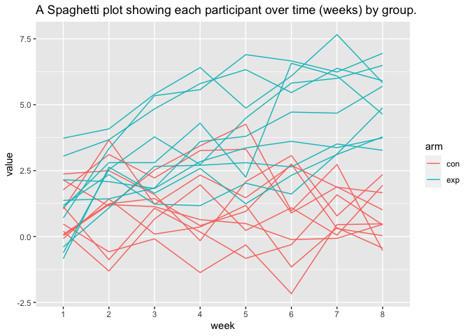

p8105\_hw5\_ajp2257
================
Amy Pitts
11/8/2020

# Problem 2

This zip file contains data from a longitudinal study that included a
control arm and an experimental arm. Data for each participant is
included in a separate file, and file names include the subject ID and
arm.

Create a tidy dataframe containing data from all participants, including
the subject ID, arm, and observations over time:

  - Start with a dataframe containing all file names; the list.files
    function will help
  - Iterate over file names and read in data for each subject using
    purrr::map and saving the result as a new variable in the dataframe
  - Tidy the result; manipulate file names to include control arm and
    subject ID, make sure weekly observations are “tidy”, and do any
    other tidying that’s necessary
  - Make a spaghetti plot showing observations on each subject over
    time, and comment on differences between groups.

<!-- end list -->

``` r
files = list.files("data", pattern = "*.csv") # get the file name 
data  = files %>% # reading the data from each file 
  map(~ read_csv(file.path("data", .)))  %>%  # read in all the files
  reduce(rbind) # getting the results from the files 

# getting the arm and the id from the file names 
participant = separate(data.frame(files), col=files, sep = "([._])", into =c("arm", "id")) 
```

    ## Warning: Expected 2 pieces. Additional pieces discarded in 20 rows [1, 2, 3, 4,
    ## 5, 6, 7, 8, 9, 10, 11, 12, 13, 14, 15, 16, 17, 18, 19, 20].

``` r
# to be able to plot the data we need a values columns and a time column 
participants_df = tibble(participant, data ) %>% # combining the data and the arm and id 
  pivot_longer( # we are pivoting all the variables 
    cols = week_1:week_8,
    names_prefix = "week_",
    names_to = "week",
    values_to = "value"
  )
head(participants_df) # quick view of the data 
```

    ## # A tibble: 6 x 4
    ##   arm   id    week  value
    ##   <chr> <chr> <chr> <dbl>
    ## 1 con   01    1      0.2 
    ## 2 con   01    2     -1.31
    ## 3 con   01    3      0.66
    ## 4 con   01    4      1.96
    ## 5 con   01    5      0.23
    ## 6 con   01    6      1.09

Plotting time\!

``` r
# looking at spagetti plot over time (in weeks) by the two different arms 
ggplot(data = participants_df, aes(x = week, y = value, group = id)) + 
  geom_line(aes(color=id)) + # coloring the participants id 
  facet_grid(. ~ arm) + # splitting the graph by arm
  labs(
    title = "A Spaghetti plot showing each participant over time (weeks) by group."
  )
```

<!-- -->

In looks like in the control group the values seem to stay on the lower
side never going above about 4. The experiment group starts with values
on the lower side just like the control group but then the values
increase over time. In the later weeks it looks like the control group
and the experiment group are different with the experiment group having
bigger values.

# Problem 3

When designing an experiment or analysis, a common question is whether
it is likely that a true effect will be detected – put differently,
whether a false null hypothesis will be rejected. The probability that a
false null hypothesis is rejected is referred to as power, and it
depends on several factors, including: the sample size; the effect size;
and the error variance. In this problem, you will conduct a simulation
to explore power in a simple linear regression.

First set the following design elements:

  - Fix \(n=30\)
  - Fix \(\sigma=5\)

Set \(\mu=0\). Generate 5000 datasets from the model
\[x \sim \textrm{Normal}[\mu, \sigma]\] For each dataset, save
\(\hat{\mu}\) and the p-value arising from a test of \(H:\mu =0\) using
\(\alpha=0.05\). Hint: to obtain the estimate and p-value, use
broom::tidy to clean the output of t.test.

Repeat the above for \(\mu=\{1,2,3,4,5,6\}\), and complete the
following:

  - Make a plot showing the proportion of times the null was rejected
    (the power of the test) on the y axis and the true value of \(\mu\)
    on the x axis. Describe the association between effect size and
    power.
  - Make a plot showing the average estimate of \(\hat{\mu}\) on the y
    axis and the true value of μ on the x axis. Make a second plot (or
    overlay on the first) the average estimate of \(\hat{\mu}\)  on the
    y axis and the true value of \(\mu\) on the x axis. Is the sample
    average of \(\hat{\mu}\) across tests for which the null is rejected
    approximately equal to the true value of \(\mu\)? Why or why not?

<!-- end list -->

``` r
set.seed(1)
n = 30
sigma = 5
alpha = 0.05

sim_est = function( mu ) {
  sim_data = tibble(
    x = rnorm(n, mean = mu, sd = sigma),
  )

  broom::tidy(t.test(sim_data, mu = mu)) %>% 
    select(estimate, p.value)
}
```

``` r
sim_results = 
  tibble(mu = c(0:6)) %>% 
  mutate(
    output_lists = map(.x = mu, ~rerun(5000, sim_est(mu = .x))),
    estimate_dfs = map(output_lists, bind_rows)) %>% 
  select(-output_lists) %>% 
  unnest(estimate_dfs)
```

Make a plot showing the proportion of times the null was rejected (the
power of the test) on the y axis and the true value of \(\mu\) on the x
axis. Describe the association between effect size and power.

``` r
sim_results %>% 
   mutate(
    mu = str_c("mu = ", mu),
    mu = fct_inorder(mu),
    reject_status = ifelse(p.value > alpha, 0, 1) # reject null = 1
    ) %>% 
  group_by(mu) %>%
  count(reject_status) %>%
  filter(reject_status == 1) %>% 
   ggplot(aes(x = mu, y = n/5000)) + 
    geom_col(aes(fill=mu)) +
    geom_hline(yintercept=0.05, linetype="dashed", size=1) +
    labs(
      title = "The Proportion of times null was rejected with different Means",
      y = "Proportion of times null was rejected"
    )
```

<!-- -->

Make a plot showing the average estimate of \(\hat{\mu}\) on the y axis
and the true value of μ on the x axis.

``` r
sim_results %>% 
   mutate(
    mu = str_c("mu = ", mu),
    mu = fct_inorder(mu),
    ) %>% 
  group_by(mu) %>%
  summarize(mean_est = mean(estimate)) %>%
    ggplot(aes(x = mu, y = mean_est)) + 
    geom_point(aes(color=mu)) +
    labs(
      title = "Mean Estimates compared to true Mu",
      y = "Mean of the Estimates"
    )
```

    ## `summarise()` ungrouping output (override with `.groups` argument)

<!-- -->

Make a second plot (or overlay on the first) the average estimate of
\(\hat{\mu}\)  on the y axis and the true value of \(\mu\) on the x
axis.

``` r
sim_results %>% 
   mutate(
    mu = str_c("mu = ", mu),
    mu = fct_inorder(mu),
    reject_status = ifelse(p.value > alpha, 0, 1) # reject null = 1
    ) %>% 
  group_by(mu, reject_status) %>%
  summarize(mean_est = mean(estimate)) %>%
  filter(reject_status == 1) %>%
    ggplot(aes(x = mu, y = mean_est)) +
    geom_point(aes(color=mu)) +
    labs(
      title = "Mean Estimates compared to true Mu of only the rejections",
      y = "Mean of the Estimates"
    )
```

    ## `summarise()` regrouping output by 'mu' (override with `.groups` argument)

<!-- -->
